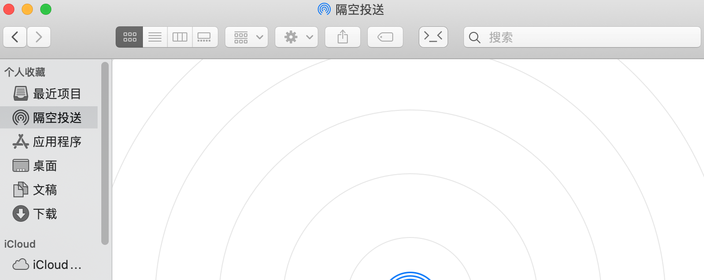

# Go2Shell By AppleScript

## Introduce

Go2Shell does not support the latest Mac system，So there's this tool. Open a iTerm2 or Termnal window to the current directory in Finder by a simple click. We support all Finders from 10.6.1 to 14.1.

## How to use

- Copy the corresponding app to the Application directory。
- Hold down the Command key and drag it to the toolbar.
- Click the icon, a iTerm2 window pop up with current directory.

## Thanks

The main implementation comes from [wonderyue/Go2ShellAppleScript](https://github.com/wonderyue/Go2ShellAppleScript), I just changed the icon and added a new window to open iTerm2 like Go2Shell。
